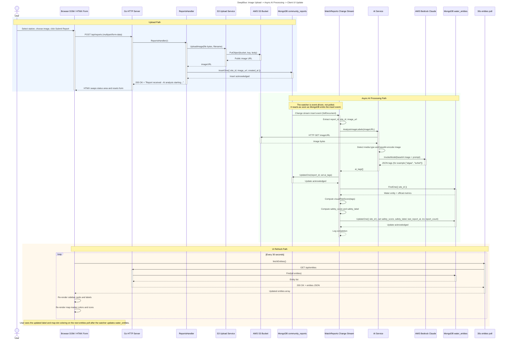

# DeepBlue Upload Sequence Diagram

This Mermaid sequence diagram shows the full path from a user uploading an image to the frontend showing a changed safety label and marker color.

You can paste the Mermaid block below into [Mermaid Live Editor](https://mermaid.live) to preview it and export a PNG or SVG.

